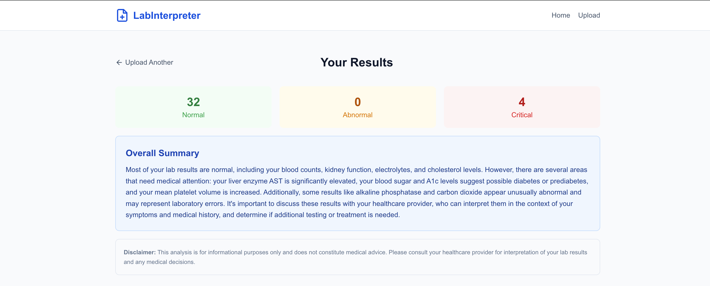
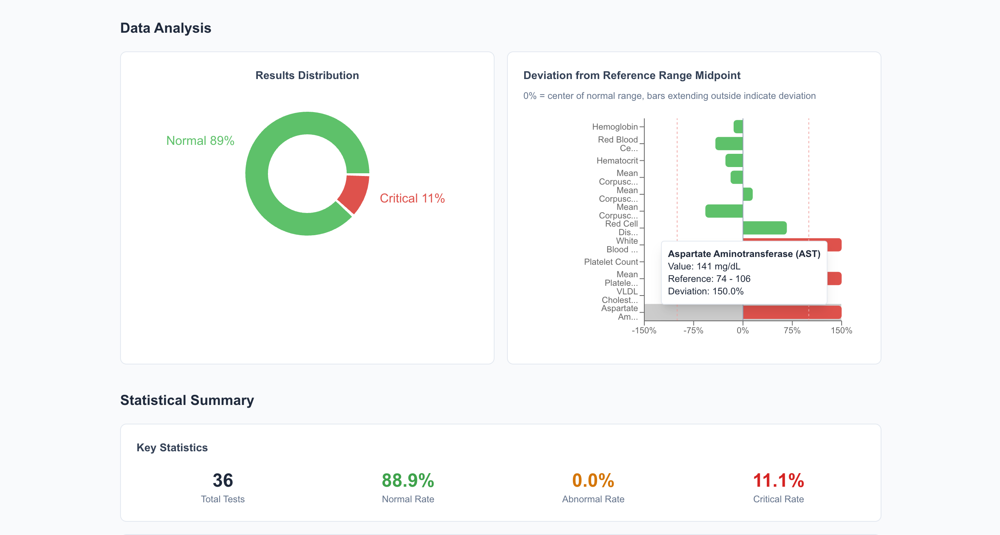
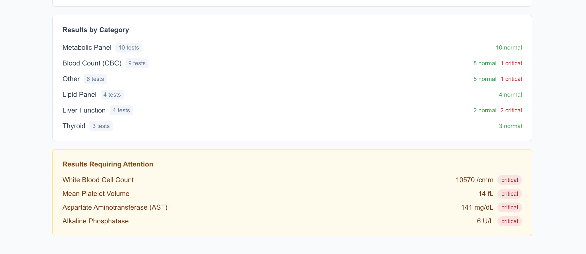
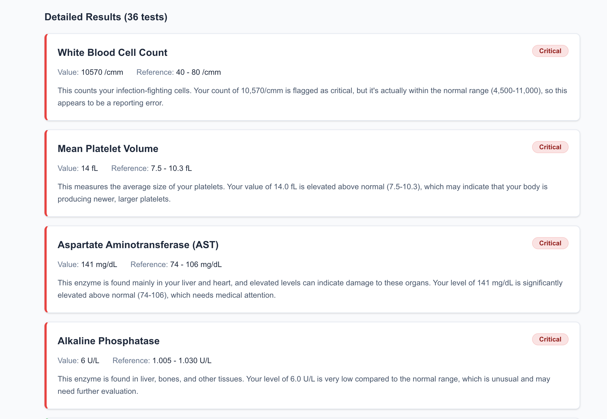
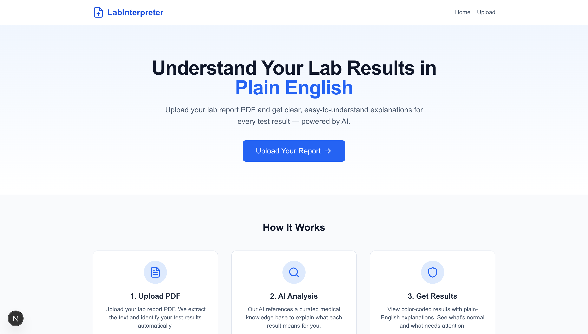

# Lab Result Interpreter

A healthcare data extraction and analysis platform that parses lab report PDFs, extracts lab values, flags abnormals, and uses RAG + Claude AI to explain each result in plain English — with interactive data visualizations.

## Screenshots

### Results Summary with AI Analysis


### Data Visualizations


### Statistical Summary by Category


### Detailed Results with Explanations


### Landing Page


## Features

- **PDF Data Extraction** — Parses unstructured lab report PDFs using PyMuPDF and multi-strategy regex pattern matching
- **Anomaly Detection** — Automatically flags values as Normal, Abnormal, or Critical based on reference ranges
- **AI Explanations** — Uses RAG (TF-IDF retrieval) + Claude API to generate plain-English explanations
- **Interactive Visualizations** — Pie charts, deviation bar charts, and statistical dashboards built with Recharts
- **Category Breakdown** — Groups results by test category (CBC, Metabolic Panel, Lipid Panel, Liver Function, Thyroid)
- **Results Requiring Attention** — Highlights abnormal and critical values that need follow-up

## Stack

- **Frontend:** Next.js + TypeScript + Tailwind CSS + Recharts
- **Backend:** Python / FastAPI
- **RAG:** TF-IDF vector search (scikit-learn) over curated medical knowledge base
- **LLM:** Claude API (Anthropic)
- **Deploy:** Vercel (frontend) + Render (backend)

## How It Works

1. User uploads a lab report PDF
2. PyMuPDF extracts text from the PDF
3. Regex parser identifies lab values (test name, value, unit, reference range)
4. TF-IDF vector search retrieves relevant medical knowledge for each test
5. Claude API generates plain-English explanations using the lab values + medical context
6. Frontend displays results with visualizations, statistics, and color-coded badges

## Getting Started

### Backend

```bash
cd backend
python3 -m venv venv
source venv/bin/activate
pip install -r requirements.txt

# Set your Anthropic API key
cp .env.example .env
# Edit .env and add your ANTHROPIC_API_KEY

# Run the server
uvicorn app.main:app --reload --port 8000
```

### Frontend

```bash
cd frontend
npm install

# Set the API URL
cp .env.example .env.local
# Edit .env.local if needed (defaults to http://localhost:8000)

# Run the dev server
npm run dev
```

Then open http://localhost:3000 in your browser.

## Deployment

### Backend (Render)

1. Push code to GitHub
2. Create a new Web Service on Render
3. Set build command: `pip install -r requirements.txt`
4. Set start command: `uvicorn app.main:app --host 0.0.0.0 --port $PORT`
5. Add environment variables: `ANTHROPIC_API_KEY`, `FRONTEND_URL`

### Frontend (Vercel)

1. Import the repository on Vercel
2. Set root directory to `frontend`
3. Add environment variable: `NEXT_PUBLIC_API_URL` (your Render backend URL)

## Supported Lab Tests

- **Complete Blood Count (CBC):** WBC, RBC, Hemoglobin, Hematocrit, Platelets, MCV, MCH, MCHC, RDW
- **Metabolic Panel:** Glucose, BUN, Creatinine, Sodium, Potassium, Chloride, CO2, Calcium, Albumin, Bilirubin, ALP, AST, ALT
- **Lipid Panel:** Total Cholesterol, HDL, LDL, Triglycerides, VLDL
- **Thyroid:** TSH, Free T4, Free T3
- **Other:** HbA1c, Iron, Ferritin, Vitamin D, Vitamin B12, Uric Acid, Magnesium

## Disclaimer

This tool is a personal project for informational purposes only. Please consult healthcare professionals for medical advice.
